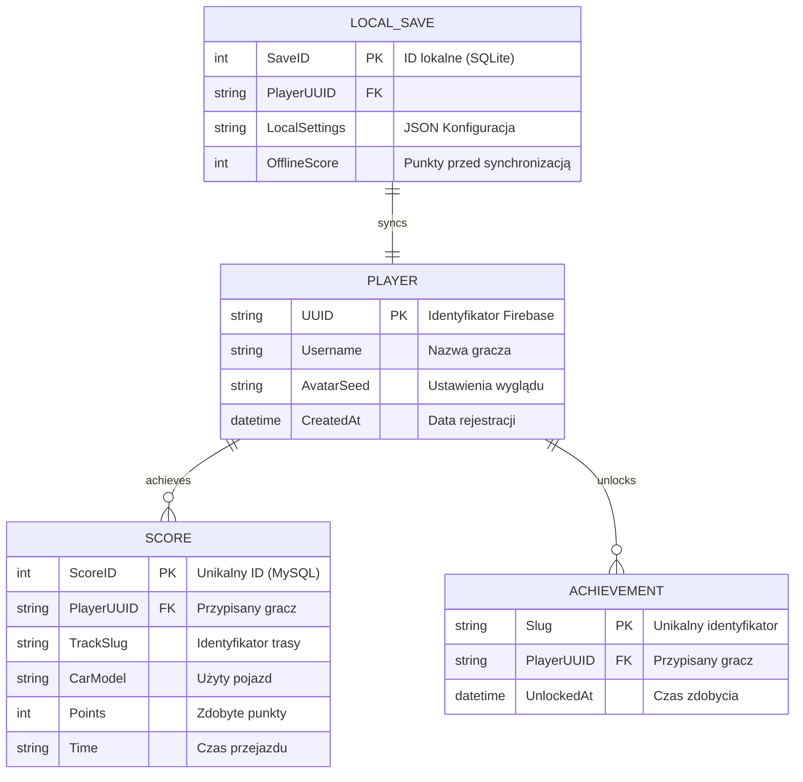

# 🗄️ Architektura Baz Danych

Projekt **DriveAndAlive** wykorzystuje rozproszoną architekturę danych, dopasowaną do wymogów wydajnościowych zarówno na urządzeniach mobilnych, jak i w chmurze. 

Używamy hybrydowego podejścia poliglotycznego, w którym różne typy baz danych obsługują specyficzne zadania.

## 1. Wykorzystane technologie bazodanowe
1. **SQLite (Relacyjna, Lokalna):** Wykorzystywana w aplikacji mobilnej do szybkiego zapisu postępów gracza (stan gry, odblokowane auta) bez konieczności połączenia z internetem.
2. **Firebase (NoSQL / Chmura):** System autoryzacji (Authentication) używany do bezpiecznego przechowywania danych logowania użytkowników na różnych urządzeniach.
3. **MySQL / Baza Relacyjna (Chmura):** Centralne repozytorium do obsługi tablicy wyników (Leaderboards). Zapewnia integralność i umożliwia szybkie sortowanie milionów rekordów.
4. **JSON (Pliki lokalne):** Służą jako bazy słowników (tłumaczenia i18n na stronie webowej) oraz jako konfiguracje proceduralnie generowanych map w grze mobilnej.

---

## 2. Diagram powiązań danych (ERD)

Poniższy graficzny schemat przedstawia architekturę przepływu danych pomiędzy systemami aplikacji:

## 3. Komunikacja z API

Bazy chmurowe (Firebase, MySQL) są hermetyzowane przez nasz własny **Backend API (Node.js + Express)**.
Frontend (strona WWW oraz w przyszłości aplikacja mobilna) odpytuje serwer API w sposób ujednolicony (REST), a to Serwis w Backendzie podejmuje decyzję o tym, do której bazy danych wysłać zapytanie.
Dzięki temu poświadczenia (np. hasła do baz SQL) nigdy nie są widoczne z poziomu aplikacji klienckiej.
