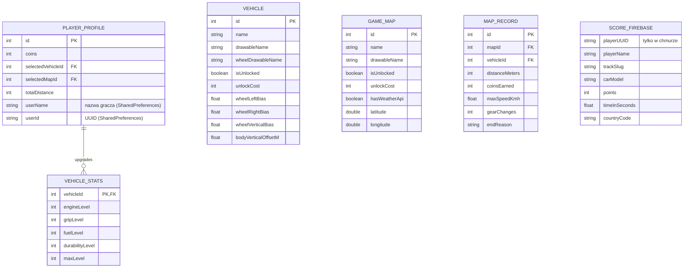

# 🗄️ Architektura Baz Danych

Projekt **DriveAndAlive** wykorzystuje rozproszoną architekturę danych, dopasowaną do wymogów wydajnościowych zarówno na urządzeniach mobilnych, jak i w chmurze. 

Używamy hybrydowego podejścia poliglotycznego, w którym różne typy baz danych obsługują specyficzne zadania.

## 1. Wykorzystane technologie bazodanowe
1. **SQLite (Relacyjna, Lokalna):** Wykorzystywana w aplikacji mobilnej do szybkiego zapisu postępów gracza (stan gry, odblokowane auta) bez konieczności połączenia z internetem.
2. **Firebase (NoSQL / Chmura):** Wykorzystywany do przechowywania najlepszych wyników graczy i wyświetlania rankingów w grze oraz na stronie webowej.
3. **JSON (Pliki lokalne):** Służą jako bazy słowników (tłumaczenia i18n na stronie webowej) oraz jako konfiguracje proceduralnie generowanych map w grze mobilnej.

---

## 2. Diagram powiązań danych (ERD)

Poniższy graficzny schemat przedstawia architekturę przepływu danych pomiędzy systemami aplikacji:

## 3. Komunikacja z chmurą

Aplikacja mobilna komunikuje się bezpośrednio z Firebase Realtime Database (bez pośredniego backendu).
Po zakończeniu wyścigu wynik jest zapisywany do Firebase za pomocą klasy FirebaseRankingRepository (transakcja zapewniająca aktualizację tylko lepszego wyniku).
Odczyt rankingu do wyświetlenia w aplikacji oraz na stronie webowej odbywa się przez to samo API Firebase (nasłuch na węźle scores).
